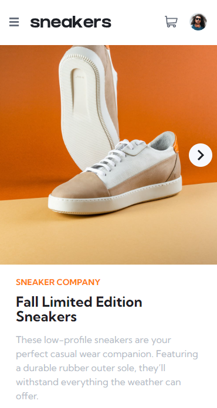
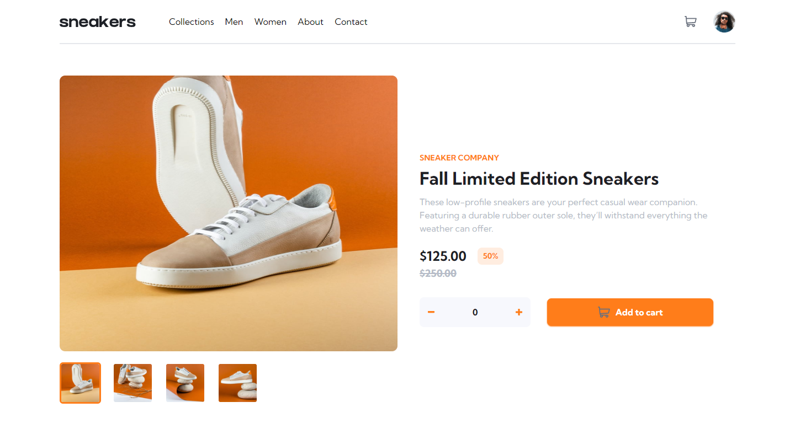

# Ecommerce Product

Welcome to the ecommerce product project: Your Online Store! This exciting project has been developed with the purpose of providing users with a complete and convenient online platform to explore and obtain detailed product information.
## Installation
Follow these steps to set up the project in your local environment:

1. Clone this repository on your machine:
```bash
git clone <url_repositorio>
cd ecommerce-product-main
```
2. Install the project dependencies by executing the following command:
```bash
npm install
```
### Despliegue
To run the project on your local server, use the following command:
```bash
npm run dev
```

Once the command is executed, you will be able to access the application in your web browser by entering the following URL: `http://localhost:5173`.

## Technologies used
The project has been developed using the following technologies:

- **Tailwind CSS**: A highly customizable CSS framework that has allowed us to design and style the user interface in an efficient and professional way.

- React**: A JavaScript library for building interactive and reusable user interfaces. React has provided us with a modern and efficient workflow for component development.

- TypeScript**: A superset of JavaScript that adds static types to the language. TypeScript has provided us with greater safety and efficiency when writing and maintaining our code.

- Vite**: A fast and modern packager for web applications. We have used Vite to compile and package the project, which has allowed us to achieve fast loading and efficient development.

## Screenshots
Below, you can see some screenshots of the project:

Screen of the project on mobile devices:
.

Project screen on desktop:


## License
This project is licensed under the [MIT](LICENSE) License.